# Animox.js - Convert Your Long Javascript Code to One Liner 

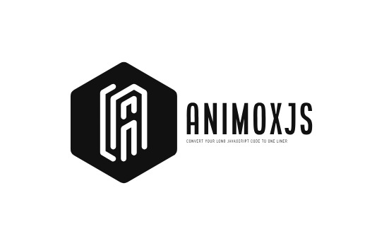

Animox.js works like magic for frontend developers. Instead of spending lots of time writing complex code to create simple effects in web development, Animox.js condenses lengthy code into just a single line. This streamlines the development process, enabling developers to build better websites with less effort and time. This GitHub readme will walk you through the key aspects of using Animox.js in your web development journey.

## Table of Contents

- [Animox.js - Convert Your Long Javascript Code to One Liner](#animoxjs---convert-your-long-javascript-code-to-one-liner)
  - [Table of Contents](#table-of-contents)
  - [Introduction](#introduction)
  - [Demos](#demos)
  - [Getting Started](#getting-started)
  - [Mouse Followers](#mouse-followers)
  - [Magnet Effects](#magnet-effects)
  - [Text Effects](#text-effects)
  - [Sticky Navbar Effects](#sticky-navbar-effects)
  - [Scrolling](#scrolling)
  - [Text Split](#text-split)
  - [Scroll To Top](#scroll-to-top)
  - [Hover Effects](#hover-effects)
  - [OnHoverExpand Effect](#onhoverexpand-effect)
  - [Button Hover Effects](#button-hover-effects)
  - [Theme Toggler](#theme-toggler)
  - [ImageTrail Effect](#imagetrail-effect)
  - [InfiniteCarousel Effect](#infinitecarousel-effect)
  - [Image Slider Effect](#image-slider-effect)
  - [Updates](#updates)
  - [Inspiration](#inspiration)
  - [Homepage](#homepage)
  - [Contributing](#contributing)
  - [License](#license)

## Introduction

Animox.js simplifies the process of bringing everyday cool effects into your web applications. With Animox.js, developers can effortlessly incorporate these effects without the need for complex and time-consuming coding, enhancing the overall user experience.

## Demos
Here you can find all the syntax and properties for the effects 

To use Animox.js in your project, you can include it in your HTML file via a CDN.

```html
<link rel="stylesheet" href="https://unpkg.com/animoxjs@1.0.4/dist/Animox.min.css">
```

```html
<script type="text/javascript" src="https://unpkg.com/animoxjs@1.0.4/dist/Animox.min.js"></script>
```

## Getting Started

Once you have included Animox.js in your project, you can start using its effects and functionalities. The library provides a straightforward API to make implementation easier.

```javascript
// Example code to initialize Animox.js and use the cool effects.
// use $ for queryselector
$(".cursor").MouseFollower();
```


## Mouse Followers

This feature creates smooth mouse follower, creating an engaging user experience, with different varities of mouse followers. it has total of Seven (7) Effects so please try it by yourself or refer our demo page for proper explanation

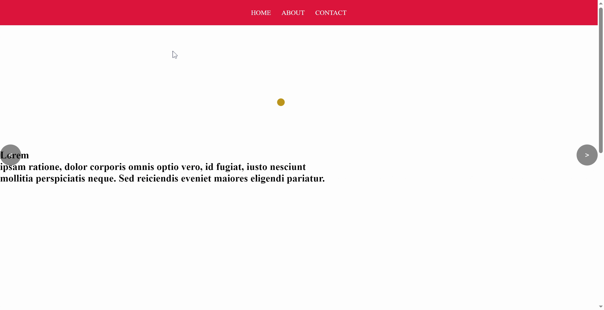
```javascript
//style 1
$(".cursor").MouseFollower({
  //Parameters are optional.
  style: 1, //(1 to 7)
  bgColor: "royalBlue" // or "#000"
});
```
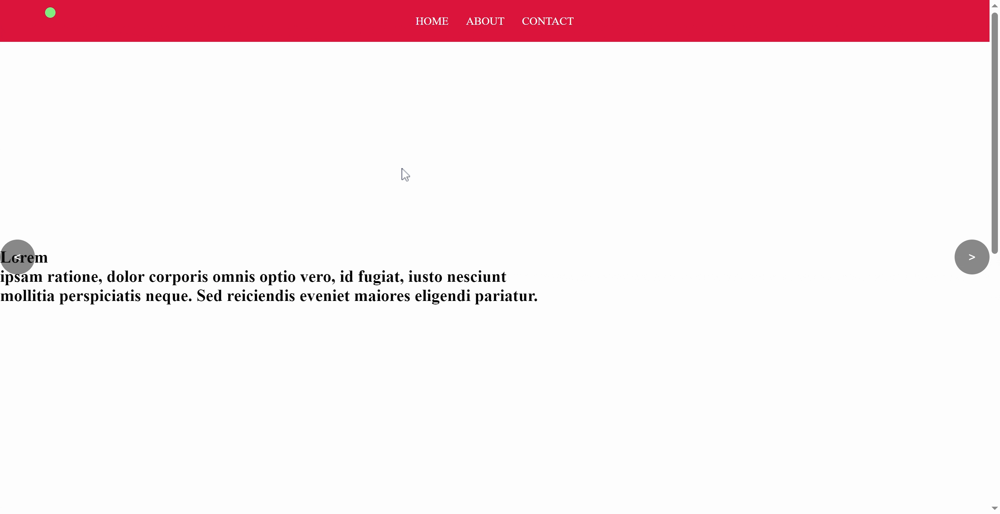
```javascript
//style 2
$(".cursor").MouseFollower({
  //Parameters are optional.
  style: 2,
  bgColor: "purple" // or "#000"
});
```
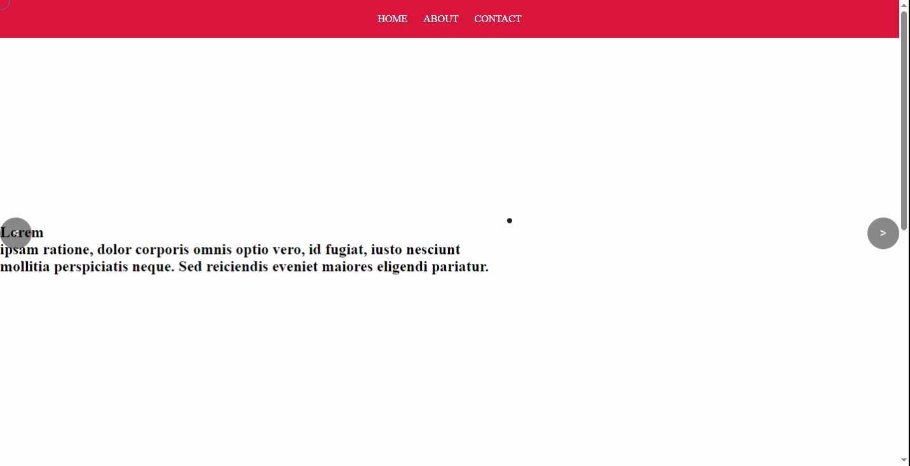
```javascript
//style 3
$(".cursor").MouseFollower({
  //Parameters are optional.
  style: 3,
  bgColor: "#1c1c1c",
  border: "1px solid royalblue"
});
```
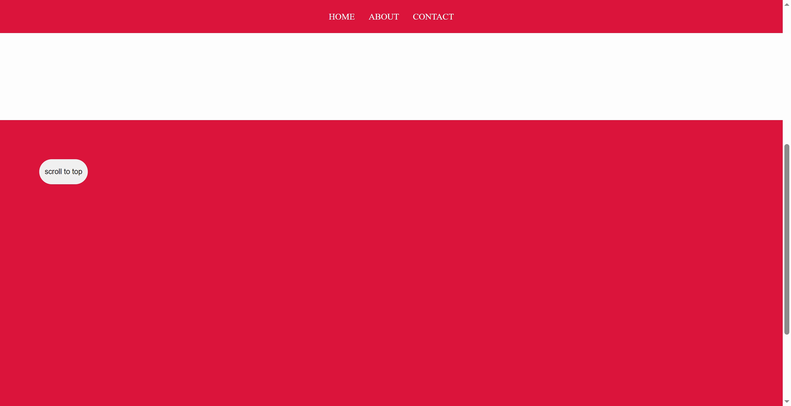
```javascript
//style 4
$(".cursor").MouseFollower({
    //Parameters are optional.
    style: 4,
    colors:  ["#0c455c", "#00556f", "#006580", "#00768e", "#00879a", "#0099a3", "#00aaa9", "#00bcab", "#00cda9", "#00dea4", "#00ef9d", "#2bff92"]// it is application for only style 4
  });
```

```javascript
//style 5
$(".cursor").MouseFollower({
    //Parameters are optional.
    style: 5,
  });
```

```javascript
//style 6
$(".cursor").MouseFollower({
    //Parameters are optional.
    style: 6,
  });
```
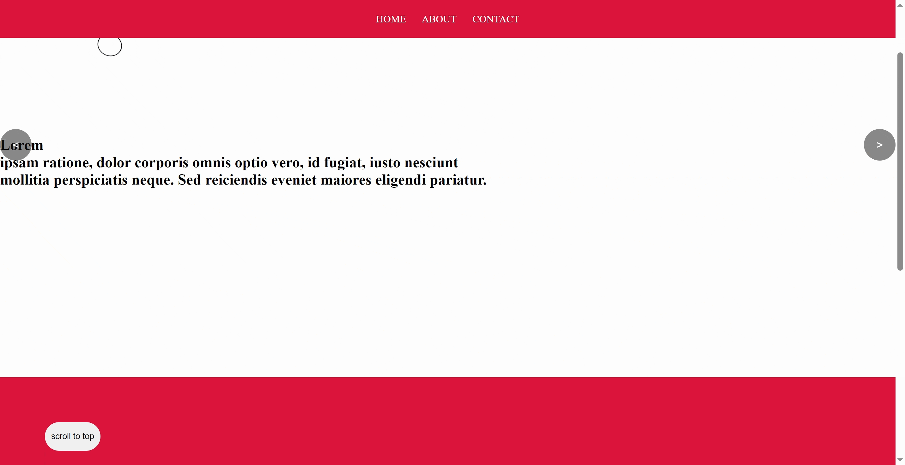
```javascript
//style 7
$(".cursor").MouseFollower({
    //Parameters are optional.
    style: 7, // it gets skewed when moved fast
  });
```

## Magnet Effects

The magnet mouse attractor effect draws elements towards the cursor, as if they are magnetically attracted, offering a unique and interactive experience.
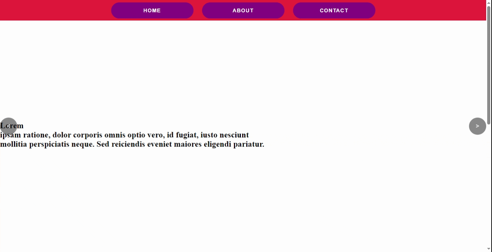
```javascript
//style 1
$(".navbar ul li").Magnet({
    //Parameters are optional.
    style: 1, //(1 to 2)
    bgColor: "purple", // it creates magnetic buttons
    fontFamily: "sans-serif",
    fontSize: "15px"
  });
```

```javascript
//style 2
$(".navbar ul li").Magnet({
    //Parameters are optional.
    style: 2, //(1 to 2)
    ease: "cubic-bezier(0.28, 0.6, 0.352, 1.6)",
    duration: 0.95,
  });
```

## Text Effects

The text Effect animates text with cool animation , with many different animations.

```javascript
//style 1
let Text = document.querySelector(".text h2"); // for single element
let MText = document.querySelectorAll(".text h2"); // for multiple Elements

TextEffect(MText, {
    style: 1, // or any other style you want to apply
});
```
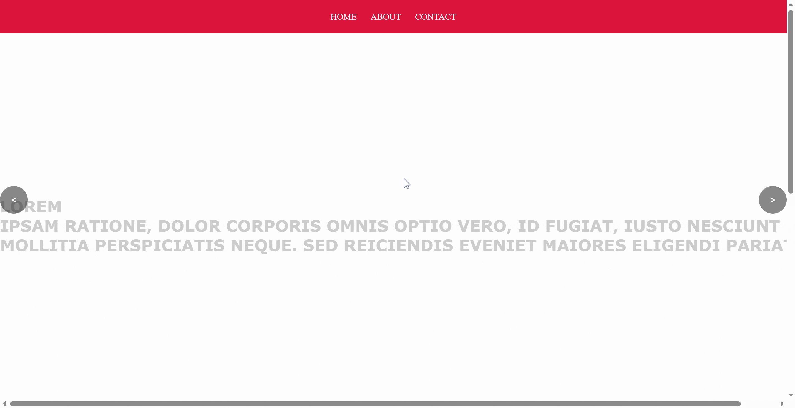
```javascript
//style 2
let Text = document.querySelector(".text h2"); // for single element
let MText = document.querySelectorAll(".text h2"); // for multiple Elements

TextEffect(MText, {
    style: 2, // or any other style you want to apply
});
```
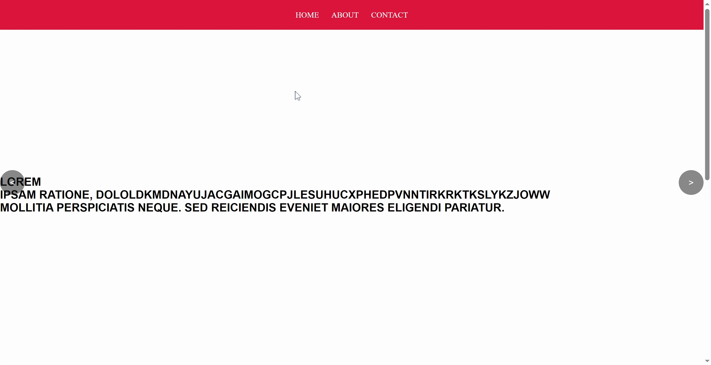
```javascript
//style 3
let Text = document.querySelector(".text h2"); // for single element
let MText = document.querySelectorAll(".text h2"); // for multiple Elements

TextEffect(MText, {
    style: 3, // or any other style you want to apply
});
```
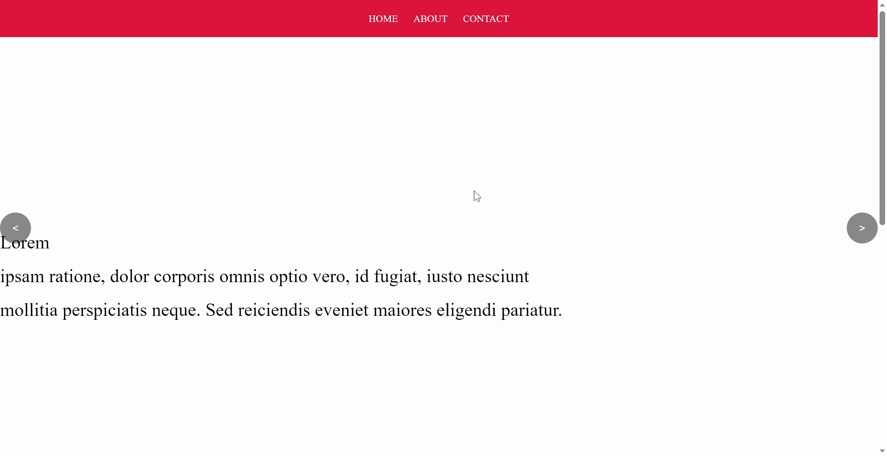
```javascript
//style 4
let Text = document.querySelector(".text h2"); // for single element
let MText = document.querySelectorAll(".text h2"); // for multiple Elements

TextEffect(MText, {
    style: 4, // or any other style you want to apply
});
```
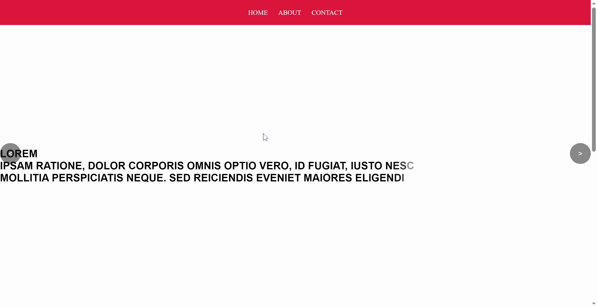
```javascript
//style 5
let Text = document.querySelector(".text h2"); // for single element
let MText = document.querySelectorAll(".text h2"); // for multiple Elements

TextEffect(MText, {
    style: 5, // or any other style you want to apply
});
```
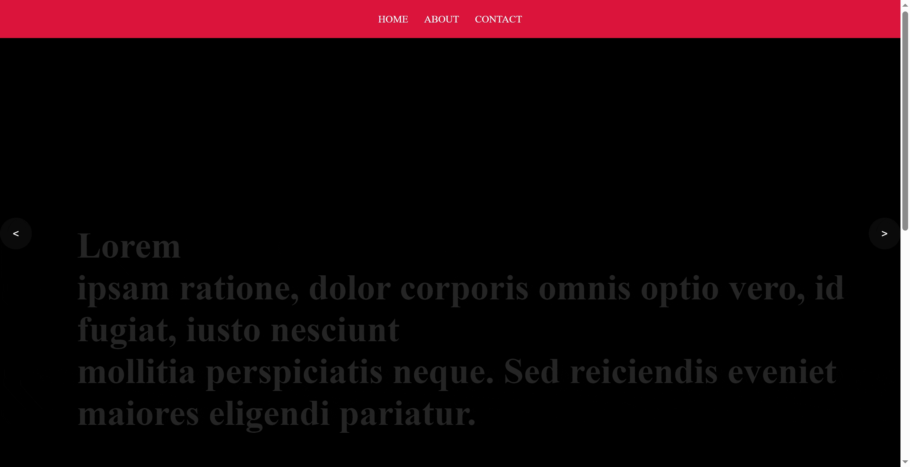
```javascript
//style 6
let Text = document.querySelector(".text h2"); // for single element
let MText = document.querySelectorAll(".text h2"); // for multiple Elements

TextEffect(MText, {
    style: 6, // or any other style you want to apply
});
```
```javascript
//style 7
let Text = document.querySelector(".text h2"); // for single element
let MText = document.querySelectorAll(".text h2"); // for multiple Elements

TextEffect(MText, {
    style: 7, // or any other style you want to apply
});
```
```javascript
//style 8
let Text = document.querySelector(".text h2"); // for single element
let MText = document.querySelectorAll(".text h2"); // for multiple Elements

TextEffect(MText, {
    style: 8, // or any other style you want to apply
});
```
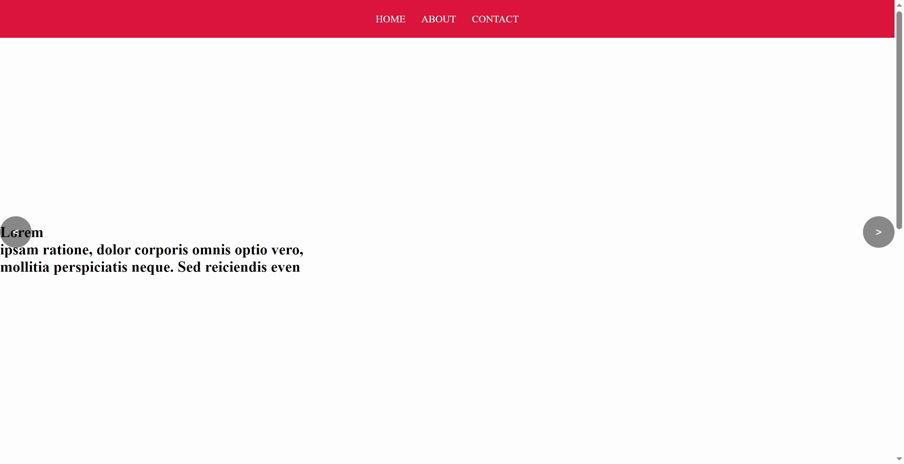
```javascript
//style 9
let Text = document.querySelector(".text h2"); // for single element
let MText = document.querySelectorAll(".text h2"); // for multiple Elements

TextEffect(MText, {
    style: 9, // or any other style you want to apply
});
```

## Sticky Navbar Effects

This will help you to change your navbar color based on the scroll.

```javascript
$(".navbar").StickyNav({
    //parameters are optional
    style: 1,
})
```
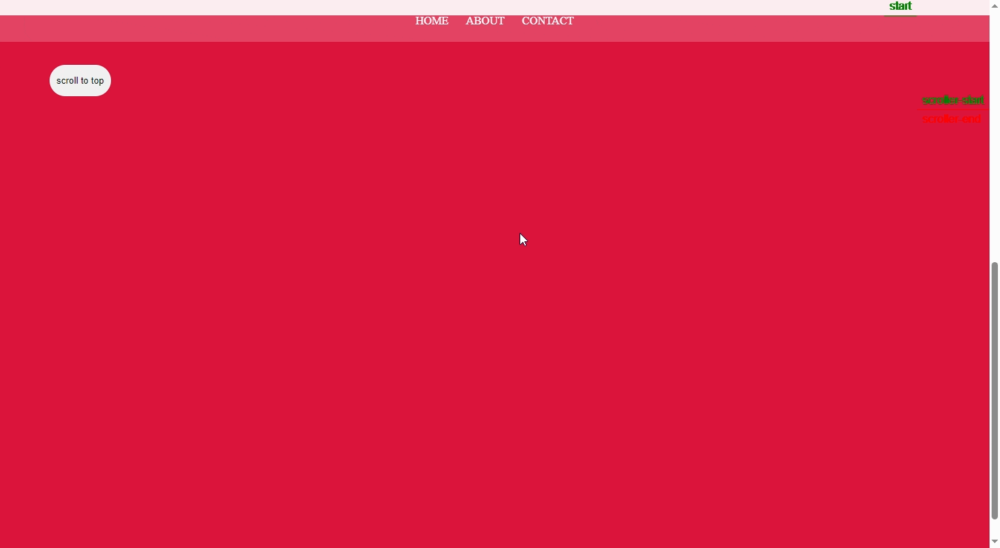
```javascript
$("body").StickyNav(".navbar",{
    //parameters are optional
    style: 2,
    bgColor: "purple",
    trigger: ".page2",
    start: "top 20%", //optional
    end: "bottom 20%",
    markers: true
})
```

## Scrolling

These helps in ease of including locomotive and scrollTrigger together and Lenis and Gsap together, using a single line of code.

```html
<!-- Add this files in same order for the proper working of the Animox library -->

<!-- for including locomotive and scrollTrigger along first include this libraries -->
<!-- Animox Js -->
<script type="text/javascript" src="https://unpkg.com/animoxjs@1.0.4/dist/Animox.min.js"></script>

<!--  Locomotive is needed for Scrolling Effects -->
 <script src="https://cdn.jsdelivr.net/npm/locomotive-scroll@3.5.4/dist/locomotive-scroll.js"></script> 
<!--  Gsap is needed for Basic Effects -->
<script src="https://cdnjs.cloudflare.com/ajax/libs/gsap/3.12.2/gsap.min.js"></script>
<!-- Scroll Trigger is needed for Scroll Effects -->
<script src="https://cdnjs.cloudflare.com/ajax/libs/gsap/3.12.2/ScrollTrigger.min.js"></script>
```
```javascript
$(".main || selector to be scrolled").Scroll({
    //parameters are optional
    style: 1 // for locomotive and gsap and scrollTrigger combined
})
```
```javascript
$(".main || selector to be scrolled").Scroll({
    //parameters are optional
    style: 2 // for locomotive and gsap
})
```

```html
<!-- for including Lenis and Gsap along first include this libraries -->
<!-- Animox Js -->
<script type="text/javascript" src="https://unpkg.com/animoxjs@1.0.4/dist/Animox.min.js"></script>

<!--  Gsap is needed for Basic Effects -->
<script src="https://cdnjs.cloudflare.com/ajax/libs/gsap/3.12.2/gsap.min.js"></script>
<!-- Scroll Trigger is needed for Scroll Effects -->
<script src="https://cdnjs.cloudflare.com/ajax/libs/gsap/3.12.2/ScrollTrigger.min.js"></script>
<!--  Lenis is needed for Scrolling Effects -->
<script src="https://unpkg.com/@studio-freight/lenis@1.0.34/dist/lenis.min.js"></script> 
```
```javascript
$(".main").Scroll({
    //parameters are optional
    style: 3 // for lenis and gsap and scrollTrigger Combined
})
```

## Text Split

This feature helps in splitting the text into Single Character without using any other library. 

```html
<h1>
  This is a Demo text and this will be separated into each Character.
</h1>
```

```javascript
$("h1 || Enter an Element").TextSplit();
```
## Scroll To Top

This feature helps you to scroll to top of the website. 

```javascript
$(".btn").ScrolltoTop({
    //parameters are optionals
    style: 1 //(1 to 2)
});
```
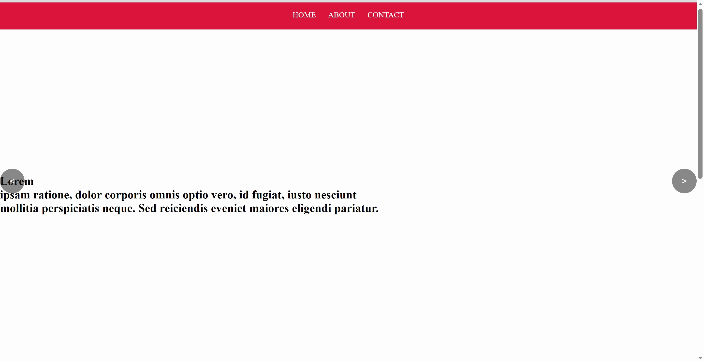
```javascript
$(".btn").ScrolltoTop({
    //parameters are optionals
    style: 2 // for progress bar use this effect
});
```
## Hover Effects

This feature helps you to add underline effects for the selected element. 
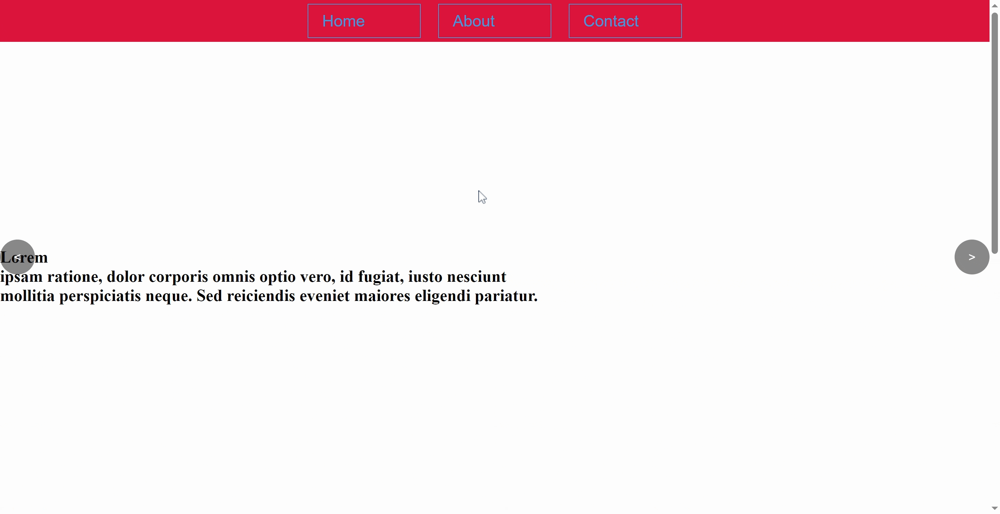
```javascript
//style 1
let button = document.querySelector(".navbar ul li");

let Mbutton = document.querySelectorAll(".navbar ul li");

HoverEffect(Mbutton, {
    style:1,
    bgColor: "purple",
    color: "red",
    width: "500px",
    height: "30px"
});
```
```javascript
//style 2
let button = document.querySelector(".navbar ul li");

let Mbutton = document.querySelectorAll(".navbar ul li");

HoverEffect(Mbutton, {
    style:2,
    effect: "center",
});
```
```javascript
let button = document.querySelector(".navbar ul li");

let Mbutton = document.querySelectorAll(".navbar ul li");

HoverEffect(Mbutton, {
    style:2,
    effect: "left",
});
```
```javascript
let button = document.querySelector(".navbar ul li");

let Mbutton = document.querySelectorAll(".navbar ul li");

HoverEffect(Mbutton, {
    style:2,
    effect: "bottom",
});
```
```javascript
let button = document.querySelector(".navbar ul li");

let Mbutton = document.querySelectorAll(".navbar ul li");

HoverEffect(Mbutton, {
    style:2,
    effect: "right",
});
```
## OnHoverExpand Effect

This feature helps you to add onHover effects for the selected element. 
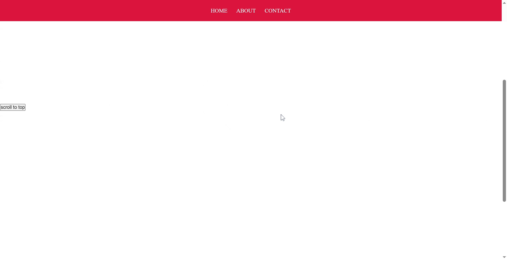
```javascript
$(".cursor").MouseFollower({
    style: 1,
});
$(".cursor || your cursor div name").onHoverExpand( ".btn || on hover to be expanded element");
```
OR
```javascript
//here we can chain two or more effects it is applicable for every effect
$(".cursor").onHoverExpand( ".btn").MouseFollower({
    style: 1,
});
```
## Button Hover Effects

This feature helps you to add Button Hover effects for the selected element. 


```javascript
$(".btn").BtnHover({
    //parameters are optionals
    style: 1,
    color: "#fff",
    bgColor: "purple"
});
```
## Theme Toggler

This feature helps you to toggle from Dark Mode to Light Mode. 
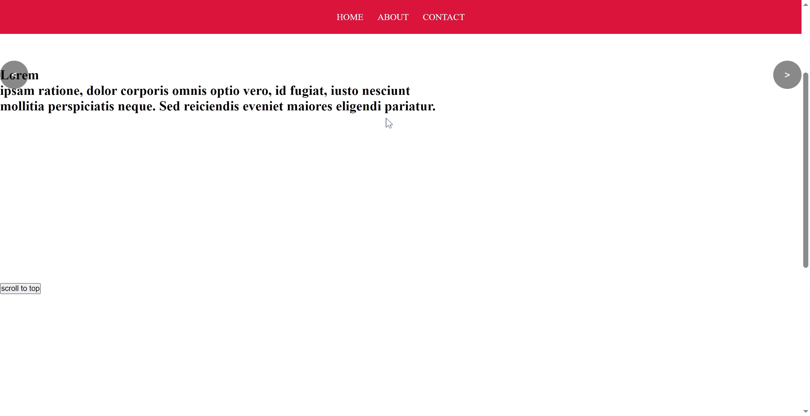
```javascript
 // Initialize the ThemeToggler
  ThemeToggler.Mode({
    elements: ['body', '.navbar', '#element1', '#element2'],
    toggleButton: document.getElementById('toggleButton')   
  });
```
## ImageTrail Effect

This feature helps you to add Image trail effects for the selected element(it should be either body or a container). 

```javascript
var images = [
    'https://plus.unsplash.com/premium_photo-1703631159456-cd2437a37fbe?w=500&auto=format&fit=crop&q=60&ixlib=rb-4.0.3&ixid=M3wxMjA3fDB8MHxlZGl0b3JpYWwtZmVlZHwyMnx8fGVufDB8fHx8fA%3D%3D',
    'https://images.unsplash.com/photo-1707851621528-c50882570d7c?w=500&auto=format&fit=crop&q=60&ixlib=rb-4.0.3&ixid=M3wxMjA3fDB8MHxlZGl0b3JpYWwtZmVlZHwzNXx8fGVufDB8fHx8fA%3D%3D',
    'https://images.unsplash.com/photo-1669886912349-cb61c99e1186?w=500&auto=format&fit=crop&q=60&ixlib=rb-4.0.3&ixid=M3wxMjA3fDB8MHxlZGl0b3JpYWwtZmVlZHwzOXx8fGVufDB8fHx8fA%3D%3D',
    'https://plus.unsplash.com/premium_photo-1707227792423-def236793f48?w=500&auto=format&fit=crop&q=60&ixlib=rb-4.0.3&ixid=M3wxMjA3fDB8MHxlZGl0b3JpYWwtZmVlZHw0N3x8fGVufDB8fHx8fA%3D%3D',
    'https://images.unsplash.com/photo-1706354924653-eab4b40d7cc6?w=500&auto=format&fit=crop&q=60&ixlib=rb-4.0.3&ixid=M3wxMjA3fDB8MHxlZGl0b3JpYWwtZmVlZHw2MHx8fGVufDB8fHx8fA%3D%3D',
    // Add more image URLs or image sources as needed
  ];

$(".main").ImageTrail();
```
## InfiniteCarousel Effect

This feature helps you to add InfiniteCarousel effects for the selected element it makes that element infinite scrollable. 

```javascript
//image scroller
var images = [
    'https://images.unsplash.com/photo-1682687982185-531d09ec56fc?w=500&auto=format&fit=crop&q=60&ixlib=rb-4.0.3&ixid=M3wxMjA3fDF8MHxlZGl0b3JpYWwtZmVlZHwxfHx8ZW58MHx8fHx8',
    'https://images.unsplash.com/photo-1706625669737-7235e82eee30?w=500&auto=format&fit=crop&q=60&ixlib=rb-4.0.3&ixid=M3wxMjA3fDB8MHxlZGl0b3JpYWwtZmVlZHwzfHx8ZW58MHx8fHx8',
    'https://images.unsplash.com/photo-1707666440778-5cca9c962c3f?w=500&auto=format&fit=crop&q=60&ixlib=rb-4.0.3&ixid=M3wxMjA3fDB8MHxlZGl0b3JpYWwtZmVlZHw5fHx8ZW58MHx8fHx8',
    // Add more image URLs as needed
  ];
  
$(".page2").InfiniteCarousel({
    style: 1 //(1 to 2)
  });
```
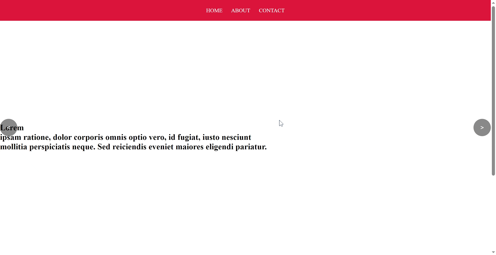
```javascript
//text scroller
  var quotes = [
    'The only way to do great work is to love what you do. - Steve Jobs',
    'Innovation distinguishes between a leader and a follower. - Steve Jobs',
    'Your time is limited, so don\'t waste it living someone else\'s life. - Steve Jobs',
    'Stay hungry, stay foolish. - Steve Jobs',
    'Quality is not an act, it is a habit. - Aristotle',
    'The best way to predict the future is to invent it. - Alan Kay',
    'The only limit to our realization of tomorrow will be our doubts of today. - Franklin D. Roosevelt',
    'Everything you can imagine is real. - Pablo Picasso',
    // Add more quotes as needed
  ];

$(".page2").InfiniteCarousel({
    style: 2
  });
```
## Image Slider Effect

This feature helps you to convert the selected element into Image Slider. it also contains an one line way to write the SwiperJs code

```html
    <div class="container">
    </div>
    <button id="prevBtn">&lt;</button>
    <button id="nextBtn">&gt;</button>
```
```javascript
var imageUrls = [
    'https://images.unsplash.com/photo-1682687982185-531d09ec56fc?w=500&auto=format&fit=crop&q=60&ixlib=rb-4.0.3&ixid=M3wxMjA3fDF8MHxlZGl0b3JpYWwtZmVlZHwxfHx8ZW58MHx8fHx8',
    'https://images.unsplash.com/photo-1706625669737-7235e82eee30?w=500&auto=format&fit=crop&q=60&ixlib=rb-4.0.3&ixid=M3wxMjA3fDB8MHxlZGl0b3JpYWwtZmVlZHwzfHx8ZW58MHx8fHx8',
    'https://images.unsplash.com/photo-1707666440778-5cca9c962c3f?w=500&auto=format&fit=crop&q=60&ixlib=rb-4.0.3&ixid=M3wxMjA3fDB8MHxlZGl0b3JpYWwtZmVlZHw5fHx8ZW58MHx8fHx8',
    // Add more image URLs as needed
  ];

$(".container").ImageSlider({
    style: 1 ,//(1 to 2)
  });
```
## Updates

This library will be updated with many other features soon, so i hope you will share this library with your Developer friends. 

if you find any bug please contact on the below email for faster resolution of your problems, Thank you for using this library ❤😃


## Inspiration

This library is inspired by Shery.js created by Sheryians 

Connect with him: [Harsh&#39;s Linkedin Profile](https://www.linkedin.com/in/harsh-sharma-924629147/)


## Homepage

For checking out the effect, check out the [Homepage]([/examples/](https://github.com/Ssaj525/Animox.js)) directory in the Animox.js repository.


Connect with me: satauheed.business@gmail.com

## Contributing

We welcome contributions from the community to enhance and expand [Animox.js](https://github.com/Ssaj525/Animox.js). If you encounter bugs, have feature suggestions, or want to contribute code, please check out our [contribution guidelines](contribution.md) for more information.

## License

Animox.js is released under the [MIT License](./licience.md). Feel free to use it in both personal and commercial projects.